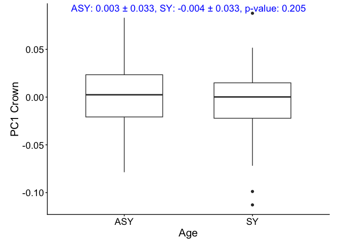
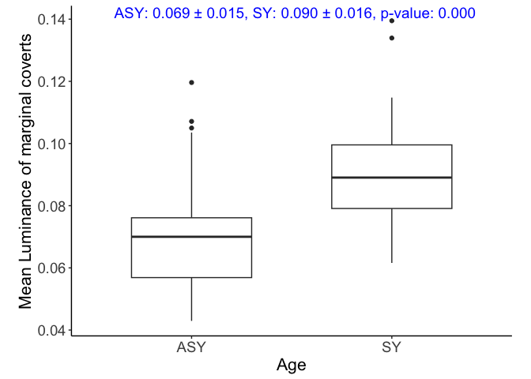
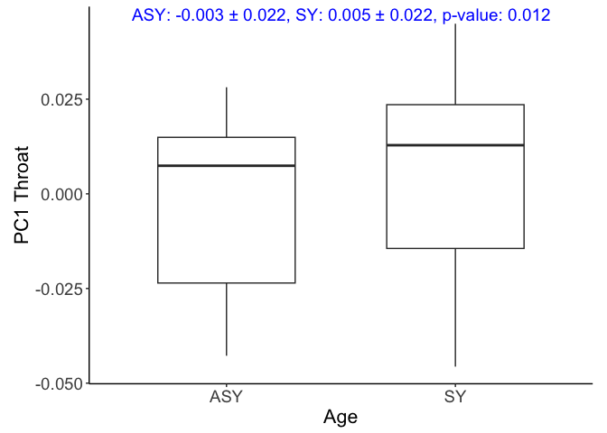

Age_Color_models
================
Ore, MJ.
2025-03-20

    ## Warning: package 'dplyr' was built under R version 4.5.2

    ## ── Attaching core tidyverse packages ──────────────────────── tidyverse 2.0.0 ──
    ## ✔ dplyr     1.2.1     ✔ readr     2.1.5
    ## ✔ forcats   1.0.1     ✔ stringr   1.6.0
    ## ✔ ggplot2   4.0.0     ✔ tibble    3.3.0
    ## ✔ lubridate 1.9.4     ✔ tidyr     1.3.1
    ## ✔ purrr     1.2.0     
    ## ── Conflicts ────────────────────────────────────────── tidyverse_conflicts() ──
    ## ✖ dplyr::filter() masks stats::filter()
    ## ✖ dplyr::lag()    masks stats::lag()
    ## ℹ Use the conflicted package (<http://conflicted.r-lib.org/>) to force all conflicts to become errors
    ## here() starts at /Users/madelynore/Documents/Work/PhD/BTBW_geographic_coloration/BTBW_plumage
    ## 
    ## Loading required package: viridisLite
    ## 
    ## here() starts at /Users/madelynore/Documents/Work/PhD/BTBW_geographic_coloration/BTBW_plumage

# Crown

    ## Warning: Removed 3 rows containing non-finite outside the scale range
    ## (`stat_boxplot()`).

<!-- -->

# coverts

    ## Warning: Removed 5 rows containing non-finite outside the scale range
    ## (`stat_boxplot()`).

<!-- -->

# throat

    ## Warning: Removed 4 rows containing non-finite outside the scale range
    ## (`stat_boxplot()`).

<!-- -->

# mantle

    ## Warning: Removed 4 rows containing non-finite outside the scale range
    ## (`stat_boxplot()`).

<!-- -->

# wingspot

    ## Warning: Removed 3 rows containing non-finite outside the scale range
    ## (`stat_boxplot()`).

<!-- -->

    ## Warning: Removed 3 rows containing non-finite outside the scale range
    ## (`stat_boxplot()`).

<!-- -->

# make a table of results

    ##                         ASY               SY        p
    ## lumMean_c    0.0718 (±0.01)  0.0718 (±0.011) 9.95e-01
    ## lumMean_m   0.0623 (±0.013) 0.0735 (±0.0074) 1.17e-11
    ## lumMean_o   0.0687 (±0.016)  0.0894 (±0.017) 1.45e-13
    ## lumMean_t  0.0433 (±0.0093) 0.0473 (±0.0097) 7.44e-03
    ## lumMean_w    0.445 (±0.047)     0.35 (±0.06) 2.44e-20
    ## area_mm2_w       43.3 (±13)      27.4 (±9.9) 2.62e-17
