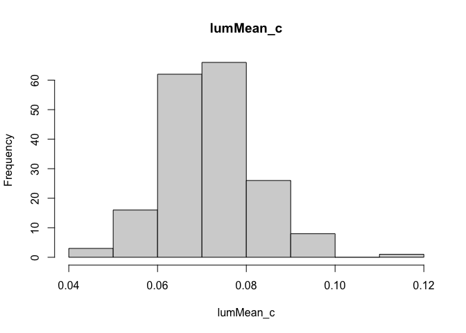
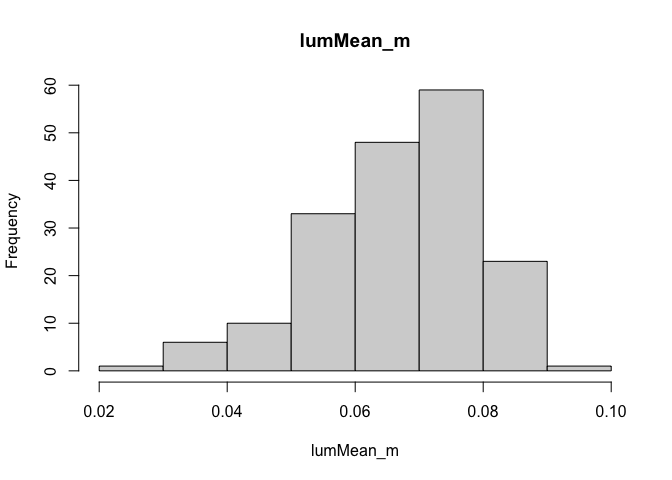
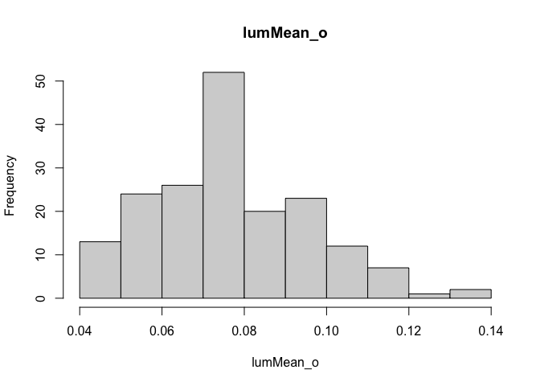
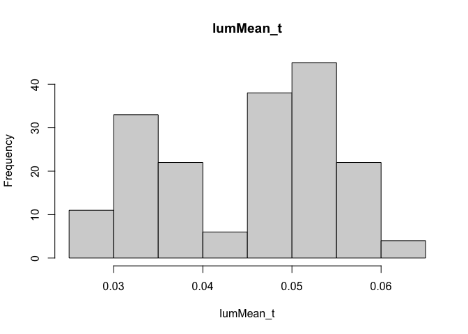
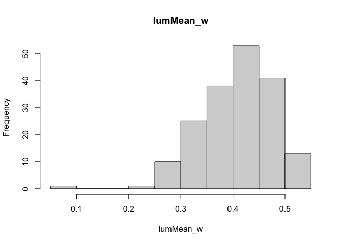
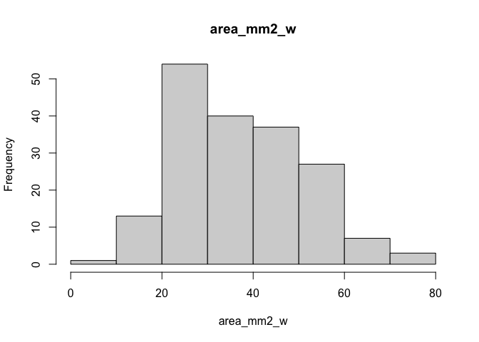

Are dark-backed birds darker overall?
================
Ore, MJ.
2025-03-10

# normality checks

<!-- --><!-- --><!-- --><!-- --><!-- --><!-- -->

# make a table of results

    ##                Response
    ## 1       Crown luminance
    ## 2      Throat luminance
    ## 3      Covert luminance
    ## 4  Wing spot area (mm²)
    ## 5       Crown luminance
    ## 6      Covert luminance
    ## 7      Mantle luminance
    ## 8      Throat luminance
    ## 9       Crown luminance
    ## 10     Covert luminance
    ## 11     Mantle luminance
    ## 12     Throat luminance
    ##                                                       Explanatory   n n_SY
    ## 1      Fixed effects: Mantle luminance + Age, Random effect: Year 178   69
    ## 2      Fixed effects: Mantle luminance + Age, Random effect: Year 179   69
    ## 3      Fixed effects: Mantle luminance + Age, Random effect: Year 178   68
    ## 4      Fixed effects: Mantle luminance + Age, Random effect: Year 180   68
    ## 5   Fixed effects: Wing spot luminance + Age, Random effect: Year 179   70
    ## 6   Fixed effects: Wing spot luminance + Age, Random effect: Year 180   70
    ## 7   Fixed effects: Wing spot luminance + Age, Random effect: Year 180   68
    ## 8   Fixed effects: Wing spot luminance + Age, Random effect: Year 180   70
    ## 9  Fixed effects: Wing spot area (mm²) + Age, Random effect: Year 179   70
    ## 10 Fixed effects: Wing spot area (mm²) + Age, Random effect: Year 180   70
    ## 11 Fixed effects: Wing spot area (mm²) + Age, Random effect: Year 180   68
    ## 12 Fixed effects: Wing spot area (mm²) + Age, Random effect: Year 180   70
    ##    Estimate  df  P_value Age_estimate Age_P_value    R2m
    ## 1      0.33 120 6.43e-06      -0.0039       0.015   0.13
    ## 2      0.36 176 3.88e-09      0.00091        0.48   0.22
    ## 3      0.71 163 6.41e-11        0.014    7.12e-09   0.47
    ## 4       -10 177     0.89          -16    4.42e-13    0.3
    ## 5     -0.02 171     0.16      -0.0033        0.11  0.013
    ## 6    0.0056 173     0.79         0.02    1.28e-09   0.25
    ## 7    -0.036 172   0.0074       0.0047       0.019   0.13
    ## 8     -0.03 172     0.01      0.00082        0.63  0.061
    ## 9  -1.1e-05 172     0.86      -0.0015        0.42 0.0039
    ## 10    6e-06 173     0.95         0.02    5.28e-11   0.25
    ## 11 -2.6e-05 173     0.67       0.0078    2.38e-05   0.11
    ## 12  4.2e-05 174     0.43       0.0044      0.0047  0.038
