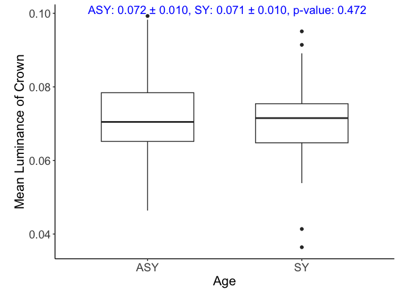
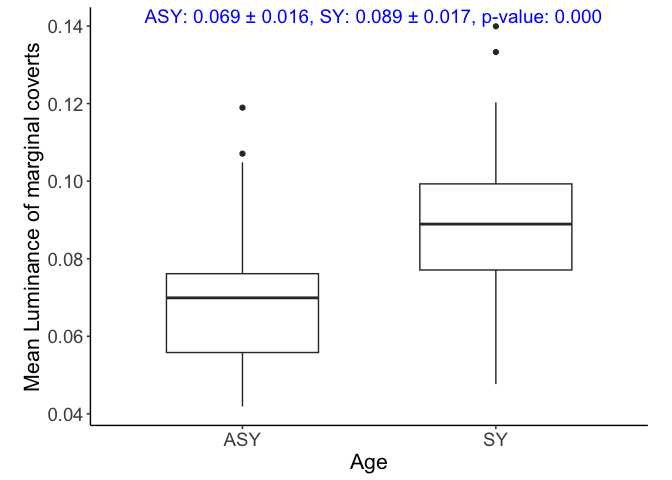
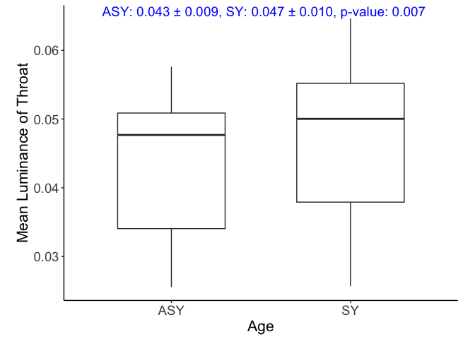
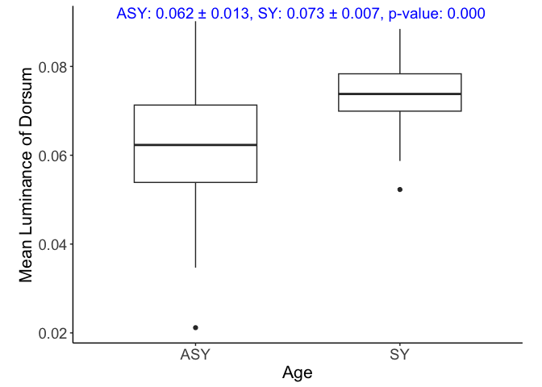
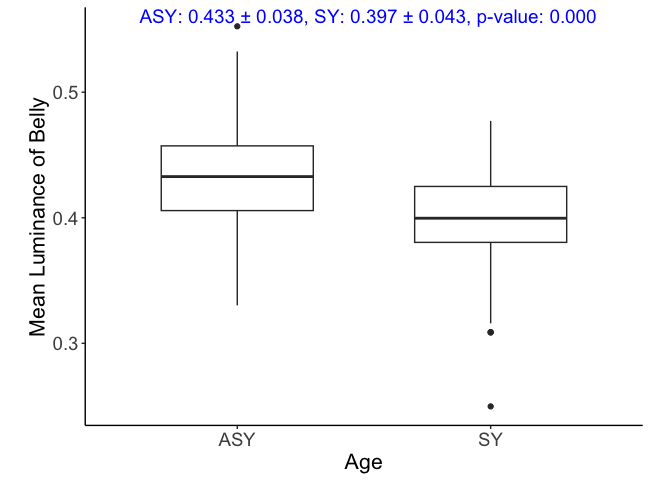

Age_Color_models
================
Ore, MJ.
2025-03-20

    ## Warning: package 'ggplot2' was built under R version 4.3.1

    ## Warning: package 'tidyr' was built under R version 4.3.1

    ## Warning: package 'readr' was built under R version 4.3.1

    ## Warning: package 'purrr' was built under R version 4.3.3

    ## Warning: package 'dplyr' was built under R version 4.3.1

    ## Warning: package 'stringr' was built under R version 4.3.1

    ## Warning: package 'lubridate' was built under R version 4.3.1

    ## ── Attaching core tidyverse packages ──────────────────────── tidyverse 2.0.0 ──
    ## ✔ dplyr     1.1.4     ✔ readr     2.1.5
    ## ✔ forcats   1.0.0     ✔ stringr   1.5.1
    ## ✔ ggplot2   3.5.1     ✔ tibble    3.2.1
    ## ✔ lubridate 1.9.3     ✔ tidyr     1.3.1
    ## ✔ purrr     1.0.4     
    ## ── Conflicts ────────────────────────────────────────── tidyverse_conflicts() ──
    ## ✖ dplyr::filter() masks stats::filter()
    ## ✖ dplyr::lag()    masks stats::lag()
    ## ℹ Use the conflicted package (<http://conflicted.r-lib.org/>) to force all conflicts to become errors
    ## here() starts at /Users/madelynore/Documents/Cornell/BTBW_geographic_coloration/BTBW_plumage

    ## Warning: package 'viridis' was built under R version 4.3.1

    ## Loading required package: viridisLite
    ## here() starts at /Users/madelynore/Documents/Cornell/BTBW_geographic_coloration/BTBW_plumage

# Crown

    ## Warning: Removed 3 rows containing non-finite outside the scale range
    ## (`stat_boxplot()`).

<!-- -->

# coverts

    ## Warning: Removed 5 rows containing non-finite outside the scale range
    ## (`stat_boxplot()`).

<!-- -->

\#throat

    ## Warning: Removed 4 rows containing non-finite outside the scale range
    ## (`stat_boxplot()`).

<!-- -->

# dorsum

    ## Warning: Removed 4 rows containing non-finite outside the scale range
    ## (`stat_boxplot()`).

<!-- -->

\#belly

    ## Warning: Removed 3 rows containing non-finite outside the scale range
    ## (`stat_boxplot()`).

<!-- -->

# wingspot

    ## Warning: Removed 3 rows containing non-finite outside the scale range
    ## (`stat_boxplot()`).

<!-- -->

    ## Warning: Removed 3 rows containing non-finite outside the scale range
    ## (`stat_boxplot()`).

<!-- -->
