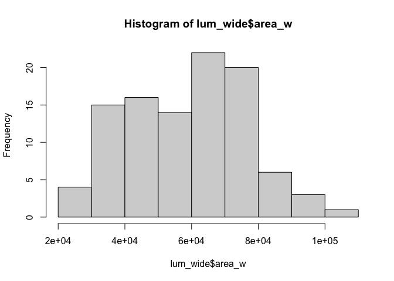
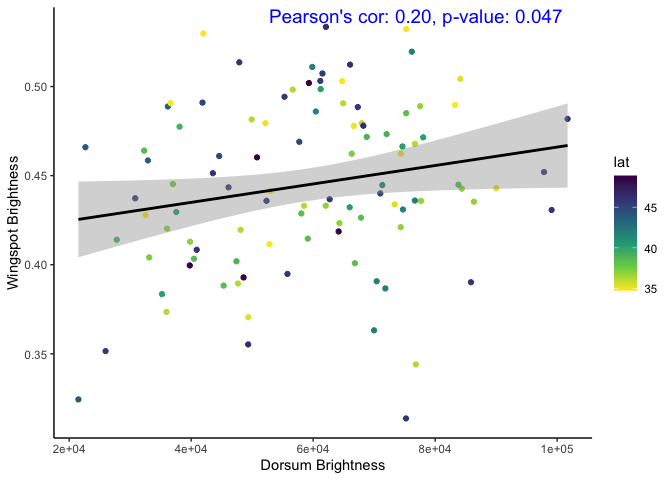

Preliminary_results_geographic_variation_plumage
================
Ore, MJ.
2024-06-18

# How does brightness of the dorsum vary across populations?

<!-- -->

<!-- -->
\# does this pattern hold for SY birds
<!-- -->
\##Short wavelength by pop

<!-- -->
\# short wavelength by indv
<!-- -->

# Correlations between body parts - Are dark backed birds darker overall?

## Dorsum vs throat

<!-- --><!-- -->

    ## 
    ##  Shapiro-Wilk normality test
    ## 
    ## data:  lum_wide$dblMean_d
    ## W = 0.9882, p-value = 0.5455

    ## 
    ##  Shapiro-Wilk normality test
    ## 
    ## data:  lum_wide$dblMean_t
    ## W = 0.88782, p-value = 4.403e-07

<!-- -->

## Dorsum vs wing covert

<!-- --><!-- -->

    ## 
    ##  Shapiro-Wilk normality test
    ## 
    ## data:  lum_wide$dblMean_d
    ## W = 0.9882, p-value = 0.5455

    ## 
    ##  Shapiro-Wilk normality test
    ## 
    ## data:  lum_wide$dblMean_o
    ## W = 0.95224, p-value = 0.00125

<!-- -->

## Dorsum and belly

<!-- -->

    ## 
    ##  Shapiro-Wilk normality test
    ## 
    ## data:  lum_wide$dblMean_b
    ## W = 0.95172, p-value = 0.001079

<!-- -->

## Dorsum and wing spot - do darker birds have whiter wing spots?

<!-- -->

    ## 
    ##  Shapiro-Wilk normality test
    ## 
    ## data:  lum_wide$dblMean_w
    ## W = 0.98225, p-value = 0.1932

<!-- -->

# are larger wingspots also brighter? no

<!-- --><!-- --><!-- -->

# Do darker birds have larger wing spots?

    ## 
    ##  Shapiro-Wilk normality test
    ## 
    ## data:  lum_wide$area_w
    ## W = 0.98435, p-value = 0.2786

    ## 
    ##  Shapiro-Wilk normality test
    ## 
    ## data:  lum_wide$dblMean_d
    ## W = 0.9882, p-value = 0.5455

<!-- -->

\#Do brighter/larger wingspots correlate to throat badge or uv in crown?

    ## 
    ##  Shapiro-Wilk normality test
    ## 
    ## data:  lum_wide$area_w
    ## W = 0.98435, p-value = 0.2786

    ## 
    ##  Shapiro-Wilk normality test
    ## 
    ## data:  lum_wide$dblMean_w
    ## W = 0.98225, p-value = 0.1932

    ## 
    ##  Shapiro-Wilk normality test
    ## 
    ## data:  lum_wide$dblMean_t
    ## W = 0.88782, p-value = 4.403e-07

    ## 
    ##  Shapiro-Wilk normality test
    ## 
    ## data:  lum_wide$uvMean_c
    ## W = 0.99419, p-value = 0.9466

<!-- --><!-- --><!-- --><!-- --><!-- --><!-- --><!-- --><!-- -->

## Do darker birds in the south have brighter/larger wingspots? do they have darker throats?

# they have brighter but NOT larger wingspots

<!-- -->

    ## 
    ## Call:
    ## lm(formula = dblMean_w ~ dblMean_d, data = s_lum)
    ## 
    ## Residuals:
    ##       Min        1Q    Median        3Q       Max 
    ## -0.109471 -0.022745 -0.000926  0.028452  0.074501 
    ## 
    ## Coefficients:
    ##             Estimate Std. Error t value Pr(>|t|)    
    ## (Intercept)  0.50345    0.04216  11.940  2.5e-13 ***
    ## dblMean_d   -0.92838    0.73804  -1.258    0.218    
    ## ---
    ## Signif. codes:  0 '***' 0.001 '**' 0.01 '*' 0.05 '.' 0.1 ' ' 1
    ## 
    ## Residual standard error: 0.04423 on 32 degrees of freedom
    ##   (9 observations deleted due to missingness)
    ## Multiple R-squared:  0.04712,    Adjusted R-squared:  0.01734 
    ## F-statistic: 1.582 on 1 and 32 DF,  p-value: 0.2175

    ## Analysis of Variance Table
    ## 
    ## Response: dblMean_w
    ##           Df   Sum Sq  Mean Sq F value Pr(>F)
    ## dblMean_d  1 0.003095 0.003095  1.5823 0.2175
    ## Residuals 32 0.062591 0.001956

<!-- -->

    ## 
    ## Call:
    ## lm(formula = area_w ~ dblMean_d, data = s_lum)
    ## 
    ## Residuals:
    ##    Min     1Q Median     3Q    Max 
    ## -28447 -13627   2048  14814  26539 
    ## 
    ## Coefficients:
    ##             Estimate Std. Error t value Pr(>|t|)   
    ## (Intercept)    55980      16502   3.392  0.00186 **
    ## dblMean_d     109696     288859   0.380  0.70663   
    ## ---
    ## Signif. codes:  0 '***' 0.001 '**' 0.01 '*' 0.05 '.' 0.1 ' ' 1
    ## 
    ## Residual standard error: 17310 on 32 degrees of freedom
    ##   (9 observations deleted due to missingness)
    ## Multiple R-squared:  0.004486,   Adjusted R-squared:  -0.02662 
    ## F-statistic: 0.1442 on 1 and 32 DF,  p-value: 0.7066

    ## Analysis of Variance Table
    ## 
    ## Response: area_w
    ##           Df     Sum Sq   Mean Sq F value Pr(>F)
    ## dblMean_d  1   43210075  43210075  0.1442 0.7066
    ## Residuals 32 9587924756 299622649

<!-- -->

    ## 
    ## Call:
    ## lm(formula = dblMean_t ~ dblMean_d, data = s_lum)
    ## 
    ## Residuals:
    ##        Min         1Q     Median         3Q        Max 
    ## -0.0123309 -0.0060150  0.0007897  0.0049559  0.0196622 
    ## 
    ## Coefficients:
    ##             Estimate Std. Error t value Pr(>|t|)   
    ## (Intercept) 0.022650   0.007896   2.868  0.00736 **
    ## dblMean_d   0.379615   0.138289   2.745  0.00997 **
    ## ---
    ## Signif. codes:  0 '***' 0.001 '**' 0.01 '*' 0.05 '.' 0.1 ' ' 1
    ## 
    ## Residual standard error: 0.008282 on 31 degrees of freedom
    ##   (10 observations deleted due to missingness)
    ## Multiple R-squared:  0.1955, Adjusted R-squared:  0.1696 
    ## F-statistic: 7.536 on 1 and 31 DF,  p-value: 0.009974

    ## Analysis of Variance Table
    ## 
    ## Response: dblMean_t
    ##           Df     Sum Sq    Mean Sq F value   Pr(>F)   
    ## dblMean_d  1 0.00051693 0.00051693  7.5355 0.009974 **
    ## Residuals 31 0.00212658 0.00006860                    
    ## ---
    ## Signif. codes:  0 '***' 0.001 '**' 0.01 '*' 0.05 '.' 0.1 ' ' 1

## Do darker birds in the North have brighter/larger wingspots?

# they have larger but NOT brighter wingspots - but that’s likely bc of age

<!-- -->

    ## 
    ## Call:
    ## lm(formula = dblMean_w ~ dblMean_d, data = n_lum)
    ## 
    ## Residuals:
    ##      Min       1Q   Median       3Q      Max 
    ## -0.11622 -0.03284  0.00455  0.03948  0.09124 
    ## 
    ## Coefficients:
    ##             Estimate Std. Error t value Pr(>|t|)    
    ## (Intercept)  0.54154    0.05777   9.373 1.55e-11 ***
    ## dblMean_d   -1.42958    0.82204  -1.739   0.0899 .  
    ## ---
    ## Signif. codes:  0 '***' 0.001 '**' 0.01 '*' 0.05 '.' 0.1 ' ' 1
    ## 
    ## Residual standard error: 0.0534 on 39 degrees of freedom
    ## Multiple R-squared:  0.07197,    Adjusted R-squared:  0.04817 
    ## F-statistic: 3.024 on 1 and 39 DF,  p-value: 0.08991

    ## Analysis of Variance Table
    ## 
    ## Response: dblMean_w
    ##           Df   Sum Sq   Mean Sq F value  Pr(>F)  
    ## dblMean_d  1 0.008623 0.0086232  3.0244 0.08991 .
    ## Residuals 39 0.111198 0.0028512                  
    ## ---
    ## Signif. codes:  0 '***' 0.001 '**' 0.01 '*' 0.05 '.' 0.1 ' ' 1

<!-- -->

    ## 
    ## Call:
    ## lm(formula = area_w ~ dblMean_d, data = n_lum)
    ## 
    ## Residuals:
    ##    Min     1Q Median     3Q    Max 
    ## -30990 -15264     96  13233  44166 
    ## 
    ## Coefficients:
    ##             Estimate Std. Error t value Pr(>|t|)    
    ## (Intercept)    84354      21048   4.008 0.000268 ***
    ## dblMean_d    -376671     299486  -1.258 0.215971    
    ## ---
    ## Signif. codes:  0 '***' 0.001 '**' 0.01 '*' 0.05 '.' 0.1 ' ' 1
    ## 
    ## Residual standard error: 19450 on 39 degrees of freedom
    ## Multiple R-squared:  0.03898,    Adjusted R-squared:  0.01434 
    ## F-statistic: 1.582 on 1 and 39 DF,  p-value: 0.216

    ## Analysis of Variance Table
    ## 
    ## Response: area_w
    ##           Df     Sum Sq   Mean Sq F value Pr(>F)
    ## dblMean_d  1 5.9865e+08 598648469  1.5819  0.216
    ## Residuals 39 1.4759e+10 378443499

<!-- -->

    ## 
    ## Call:
    ## lm(formula = dblMean_t ~ dblMean_d, data = n_lum)
    ## 
    ## Residuals:
    ##       Min        1Q    Median        3Q       Max 
    ## -0.015606 -0.003586  0.000458  0.004887  0.014288 
    ## 
    ## Coefficients:
    ##              Estimate Std. Error t value Pr(>|t|)    
    ## (Intercept) -0.005289   0.007487  -0.706    0.484    
    ## dblMean_d    0.661597   0.106394   6.218 2.86e-07 ***
    ## ---
    ## Signif. codes:  0 '***' 0.001 '**' 0.01 '*' 0.05 '.' 0.1 ' ' 1
    ## 
    ## Residual standard error: 0.006904 on 38 degrees of freedom
    ##   (1 observation deleted due to missingness)
    ## Multiple R-squared:  0.5044, Adjusted R-squared:  0.4913 
    ## F-statistic: 38.67 on 1 and 38 DF,  p-value: 2.857e-07

    ## Analysis of Variance Table
    ## 
    ## Response: dblMean_t
    ##           Df    Sum Sq   Mean Sq F value    Pr(>F)    
    ## dblMean_d  1 0.0018430 1.843e-03  38.668 2.857e-07 ***
    ## Residuals 38 0.0018112 4.766e-05                      
    ## ---
    ## Signif. codes:  0 '***' 0.001 '**' 0.01 '*' 0.05 '.' 0.1 ' ' 1

\#Age and Markers

prep data

## Are wing spots brighter or larger in ASY vs SY males

<!-- --><!-- -->

## Are backs darker in ASY vs SY males

<!-- -->

## Are crowns darker in ASY vs SY males

<!-- -->
